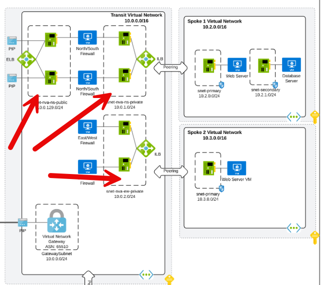

# Azure Virtual Network Spoke Terraform Module

This is an adaptation of a previous module I wrote to deploy a spoke network using the [Microsoft recommended Hub-Spoke network topology](https://docs.microsoft.com/en-us/azure/architecture/reference-architectures/hybrid-networking/hub-spoke).
This is designed to work with one hub in each region. Multiple spokes with each in separate subscriptions is also possible.

This module runs under the assumption that the spoke vnet(s) will live in a different subscription than the Hub vnet.
Because of this assumption, 2 separate azurerm providers are used.
Hub subscription is in connectivity.

Further security hardening is recommended to add appropriate NSG rules to use this for any production workloads.



Note: Another assumption is that this will be used within conjuction of the management group structure defined in the [CAF Enterprise Scale module](https://github.com/Azure/terraform-azurerm-caf-enterprise-scale)

In the CAF Enterprise Scale module, policy definitions are set within Landing Zones (where the spoke would be deployed) that by default DENY subnet creation if that subnet is not associated with a NSG.
This spoke module does associate the created subnets with NSG's but in a second step after the subnet is created.

.\.terraform\modules\enterprise_scale\modules\archetypes\lib\policy_assignments\policy_assignment_es_deny_subnet_without_nsg.tmpl.json

Because of this two-step process, it is required to adjust the Enforcement mode default behavior of the policy assignment in the CAF Enterprise Scale module from DENY to AUDIT to allow for the subnet creation.
Otherwise this module will fail to create spoke subnets because the policy prevents it.

These types of resources are supported:

- [Virtual Network](https://www.terraform.io/docs/providers/azurerm/r/virtual_network.html)
- [Subnets](https://www.terraform.io/docs/providers/azurerm/r/subnet.html)
- [Network Security Groups](https://www.terraform.io/docs/providers/azurerm/r/network_security_group.html)
- [Routing traffic to Hub firewall](https://www.terraform.io/docs/providers/azurerm/r/route_table.html)
- [Peering to Hub Network](https://www.terraform.io/docs/providers/azurerm/r/role_assignment.html)
- [Network Watcher](https://www.terraform.io/docs/providers/azurerm/r/network_watcher.html)

# Module Usage

```hcl {"id":"01HZJBXKQXDD7ZA45V9YQS8S9Y"}
# Azurerm provider configuration
provider "azurerm" {
#This is the default provider for the spoke subscription in the landing zone
  features {}
}
provider "azurerm" {
  alias = "hub"
  #this is the connectivity subscription where the hub lives
  subscription_id = "11111111-1111-1111-1111-111111111111" 
  # Subscription_id for hub would be needed here. Assumption is that is is connectivity subscription.
  features {}
}

# getting info about the hub resource group
data "azurerm_virtual_network" "hub-vnet" {
  provider            = azurerm.hub
  name                = "org-hub-eastus2-vnet"
  resource_group_name = "org-hub-eastus2"
}

module "vnet-spoke" {
  source = "./spoke-module/"

  resource_group_name = "org-shared-eastus2-01"
  location            = "eastus2"
  spoke_vnet_name     = "org-spoke1"


  # Provide valid VNet Address space for spoke virtual network.  
  vnet_address_space = ["10.88.4.0/22"]

  # Hub network details to create peering and other setup
  hub_virtual_network_id          = data.azurerm_virtual_network.hub-vnet.id
  hub_firewall_private_ip_address = "10.76.1.4"

  subnets = {

    app_subnet = {
      subnet_name           = "subnet01"
      subnet_address_prefix = ["10.88.4.0/24"]
      service_endpoints     = ["Microsoft.Storage"]

      nsg_inbound_rules = [
        # [name, priority, direction, access, protocol, destination_port_range, source_address_prefix, destination_address_prefix]
        # To use defaults, use "" without adding any value and to use this subnet as a source or destination prefix.

        # ["ssh", "200", "Inbound", "Allow", "Tcp", "22", "*", ""],
        #["rdp", "201", "Inbound", "Allow", "Tcp", "3389", "*", ""],
      ]

      nsg_outbound_rules = [
        # [name, priority, direction, access, protocol, destination_port_range, source_address_prefix, destination_address_prefix]
        # To use defaults, use "" without adding any value and to use this subnet as a source or destination prefix.

        #["ntp_out", "203", "Outbound", "Allow", "Udp", "123", "", "0.0.0.0/0"],
      ]
    }

    db_subnet = {
      subnet_name           = "subnet02"
      subnet_address_prefix = ["10.88.5.0/24"]
      service_endpoints     = ["Microsoft.Storage"]
      nsg_inbound_rules = [
        # [name, priority, direction, access, protocol, destination_port_range, source_address_prefix, destination_address_prefix]
        # To use defaults, use "" without adding any value and to use this subnet as a source or destination prefix.

        # ["https", "100", "Inbound", "Allow", "Tcp", "443", "*", "0.0.0.0/0"],
        # ["sql_port", "101", "Inbound", "Allow", "Tcp", "1433", "*", ""],
      ]

      nsg_outbound_rules = [
        # [name, priority, direction, access, protocol, destination_port_range, source_address_prefix, destination_address_prefix]
        # To use defaults, use "" without adding any value and to use this subnet as a source or destination prefix.

        ["ntp_out", "102", "Outbound", "Allow", "Udp", "123", "", "0.0.0.0/0"],
      ]
    }
  }


  # Adding TAG's to your Azure resources (Required)
  # ProjectName and Env are already declared above, to use them here, create a varible.
  tags = {
    ProjectName  = "demo-internal"
    Env          = "dev"
    Owner        = "user@example.com"
    BusinessUnit = "CORP"
    ServiceClass = "Gold"
  }
}


```

## Create resource group

By default, this module will create a resource group and the name of the resource group to be given in an argument `resource_group_name`. If you want to use an existing resource group, specify the existing resource group name, and set the argument to `create_resource_group = false`.

> *If you are using an existing resource group, then this module uses the same resource group location to create all resources in this module.*

## Subnets

This module handles the creation and a list of address spaces for subnets. This module uses `for_each` to create subnets and corresponding service endpoints, service delegation, and network security groups. This module associates the subnets to network security groups as well with additional user-defined NSG rules.

This module creates 2 subnets by default: Application Subnet and Database Subnet and both subnets route the traffic through the firewall if `hub_firewall_private_ip_address` argument set else all traffic will forward to VNet.

## Network Security Groups

By default, the network security groups connected to all subnets and only allow necessary traffic also block everything else (deny-all rule). Use `nsg_inbound_rules` and `nsg_outbound_rules` in this Terraform module to create a Network Security Group (NSG) for each subnet and allow it to add additional rules for inbound flows.

In the Source and Destination columns, `VirtualNetwork`, `AzureLoadBalancer`, and `Internet` are service tags, rather than IP addresses. In the protocol column, Any encompasses `TCP`, `UDP`, and `ICMP`. When creating a rule, you can specify `TCP`, `UDP`, `ICMP` or `*`. `0.0.0.0/0` in the Source and Destination columns represents all addresses.

> *You cannot remove the default rules, but you can override them by creating rules with higher priorities.*

```hcl {"id":"01HZJBXKQXDD7ZA45VA1Z77S35"}
module "vnet-spoke" {


  # Multiple Subnets, Service delegation, Service Endpoints
  subnets = {
    mgnt_subnet = {
      subnet_name           = "application"
      subnet_address_prefix = "10.2.2.0/24"

      nsg_inbound_rules = [
        # [name, priority, direction, access, protocol, destination_port_range, source_address_prefix, destination_address_prefix]
        # To use defaults, use "" without adding any value and to use this subnet as a source or destination prefix.
        ["weballow", "200", "Inbound", "Allow", "Tcp", "80", "*", ""],
        ["weballow1", "201", "Inbound", "Allow", "Tcp", "443", "*", ""],
      ]

      nsg_outbound_rules = [
        # [name, priority, direction, access, protocol, destination_port_range, source_address_prefix, destination_address_prefix]
        # To use defaults, use "" without adding any value and to use this subnet as a source or destination prefix.
        ["ntp_out", "103", "Outbound", "Allow", "Udp", "123", "", "0.0.0.0/0"],
      ]
    }
  }
}


```

## Peering to Hub

To peer spoke networks to the hub networks requires the service principal that performs the peering has `Network Contributor` role on hub network. Linking the Spoke to Hub DNS zones, the service principal also needs the `Private DNS Zone Contributor` role on hub network. If Log Analytics workspace is created in hub or another subscription then, the service principal must have `Log Analytics Contributor` role on workspace or a custom role to connect resources to workspace.

## Recommended naming and tagging conventions

Applying tags to your Azure resources, resource groups, and subscriptions to logically organize them into a taxonomy. Each tag consists of a name and a value pair. For example, you can apply the name `Environment` and the value `Production` to all the resources in production.
For recommendations on how to implement a tagging strategy, see Resource naming and tagging decision guide.

## Requirements

Name | Version
-----|--------
terraform | >= 1.5.0
azurerm | >= 3.7.0

## Providers

| Name | Version |
|------|---------|
azurerm | >= 3.7.0
random | n/a

## Inputs

Name | Description | Type | Default
---- | ----------- | ---- | -------
`resource_group_name` | The name of the resource group in which resources are created | string | `""`
`location`|The location of the resource group in which resources are created| string | `""`
`spoke_vnet_name`|The name of the spoke virtual network|string | `""`
`vnet_address_space`|Virtual Network address space to be used |list|`[]`
`dns_servers` | List of DNS servers to use for virtual network | list |`[]`
`subnets`|For each subnet, create an object that contain fields|object|`{}`
`subnet_name`|A name of subnets inside virtual network| object |`{}`
`subnet_address_prefix`|A list of subnets address prefixes inside virtual network|
`nsg_inbound_rule`|network security groups settings - a NSG is always created for each subnet|object|`{}`
`nsg_outbound_rule`|network security groups settings - a NSG is always created for each subnet|object|`{}`
`hub_virtual_network_id`|The Resource id of the Hub Virtual Network|string|`""`
`hub_firewall_private_ip_address`|The Private IP of the Firewall created by Hub Module|string|`""`
`use_remote_gateways`|Controls if remote gateways can be used on the local virtual network|string|`false`
`Tags`|A map of tags to add to all resources|map|`{}`

## Outputs

|Name | Description|
|---- | -----------|
`resource_group_name`|The name of the resource group in which resources are created
`resource_group_id`|The id of the resource group in which resources are created
`resource_group_location`|The location of the resource group in which resources are created
`virtual_network_name`|The name of the virtual network.
`virtual_network_id`|The virtual NetworkConfiguration ID.
`virtual_network_address_space`|List of address spaces that are used the virtual network.
`subnet_ids`|List of IDs of subnets
`subnet_address_prefixes`|List of address prefix for  subnets
`network_security_group_ids`|List of Network security groups and ids
`route_table_name`|The resource id of the route table
`route_table_id`|The resource id of the route table

## Authors

Module is maintained by [Ben Spilker](mailto:bspilker@presidio.com), with help from these [awesome contributors](https://github.com/kumarvna)

Built to work within the CAF Enterprise Scale framework but not using their connectivity resources. (https://github.com/Azure/terraform-azurerm-caf-enterprise-scale)

## Other resources

- [Hub-spoke network topology in Azure](https://docs.microsoft.com/en-us/azure/architecture/reference-architectures/hybrid-networking/hub-spoke)
- [Terraform AzureRM Provider Documentation](https://www.terraform.io/docs/providers/azurerm/index.html)
- [CAF Enterprise Scale](https://github.com/Azure/terraform-azurerm-caf-enterprise-scale)